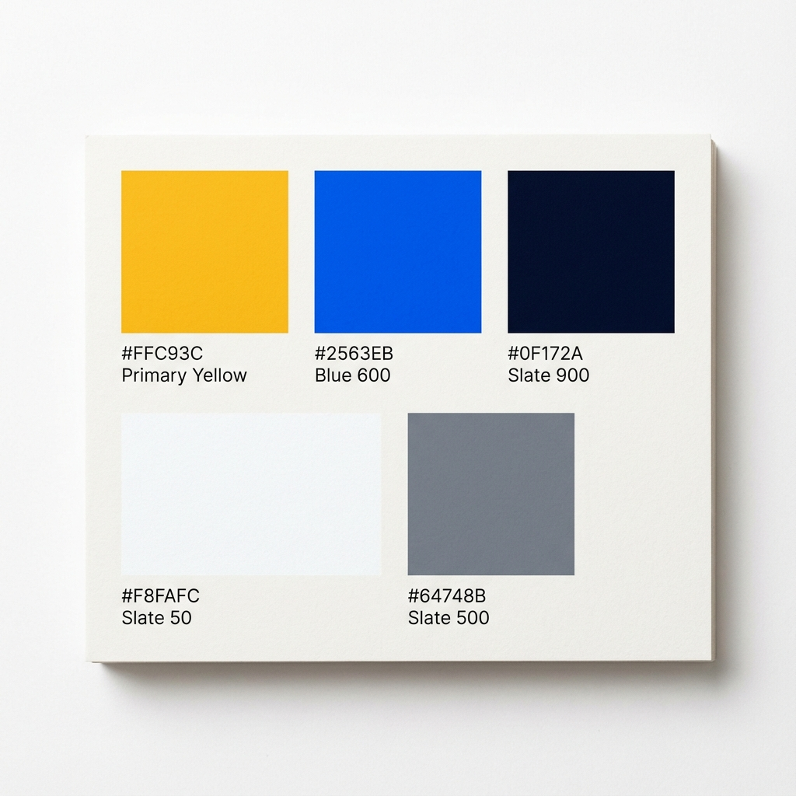

# StudioAgent - Brand Color Palette

**Versione**: 1.0  
**Data**: 2 Dicembre 2025  
**Estratto da**: Landing Page (localhost:3002)

---

## 🎨 Palette Principale

### Primary Colors

#### 🟡 **Giallo Oro** (Primary CTA)
- **Hex**: `#FFC93C`
- **RGB**: `rgb(255, 201, 60)`
- **Uso**: CTA buttons primari, highlights, accenti
- **Variante Hover**: `#FFD666` (più chiaro al 10%)
- **Accessibilità**: AA su sfondo scuro (contrast ratio > 4.5:1)

#### 🔵 **Blu Corporate** (Brand Primary)
- **Hex**: `#2563EB` (Tailwind blue-600)
- **RGB**: `rgb(37, 99, 235)`
- **Uso**: Link, icone primarie, badge, bordi focus
- **Variante Scura**: `#1E40AF` (blue-700)
- **Variante Chiara**: `#3B82F6` (blue-500)
- **Accessibilità**: AAA su sfondo bianco

---

## ⚫⚪ Colori Neutri

### Slate Scale (Grigi professionali)

#### **Slate 900** (Text Primary)
- **Hex**: `#0F172A`
- **RGB**: `rgb(15, 23, 42)`
- **Uso**: Testo principale, titoli, icone scure
- **Contrast**: AAA su bianco

#### **Slate 800**
- **Hex**: `#1E293B`
- **RGB**: `rgb(30, 41, 59)`
- **Uso**: Testo secondario, button hover states

#### **Slate 700**
- **Hex**: `#334155`
- **RGB**: `rgb(51, 65, 85)`
- **Uso**: Testo muted, descrizioni

#### **Slate 600**
- **Hex**: `#475569`
- **RGB**: `rgb(71, 85, 105)`
- **Uso**: Placeholder, label secondari

#### **Slate 500**
- **Hex**: `#64748B`
- **RGB**: `rgb(100, 116, 139)`
- **Uso**: Icone secondarie, testo disabilitato

#### **Slate 400**
- **Hex**: `#94A3B8`
- **RGB**: `rgb(148, 163, 184)`
- **Uso**: Bordi chiari, separatori, icone background

#### **Slate 300**
- **Hex**: `#CBD5E1`
- **RGB**: `rgb(203, 213, 225)`
- **Uso**: Bordi input, separatori visibili

#### **Slate 200**
- **Hex**: `#E2E8F0`
- **RGB**: `rgb(226, 232, 240)`
- **Uso**: Bordi card, separatori sezione

#### **Slate 100**
- **Hex**: `#F1F5F9`
- **RGB**: `rgb(241, 245, 249)`
- **Uso**: Background secondario, hover states

#### **Slate 50**
- **Hex**: `#F8FAFC`
- **RGB**: `rgb(248, 250, 252)`
- **Uso**: Background alternato sezioni

#### **Bianco Puro**
- **Hex**: `#FFFFFF`
- **RGB**: `rgb(255, 255, 255)`
- **Uso**: Card, modali, background principale

---

## 🎯 Colori Semantici

### Success (Verde)
- **Green 500**: `#22C55E` - Checkmarks, success messages
- **Green 600**: `#16A34A` - Success button hover
- **Green 100**: `#DCFCE7` - Success background light
- **Green 50**: `#F0FDF4` - Success highlight

### Warning (Giallo)
- **Yellow 400**: `#FACC15` - Stars, ratings, warnings
- **Yellow 500**: `#EAB308` - Warning icons
- **Yellow 100**: `#FEF9C3` - Warning background

### Error (Rosso)
- **Red 500**: `#EF4444` - Error messages, destructive actions
- **Red 600**: `#DC2626` - Error button hover
- **Red 100**: `#FEE2E2` - Error background light

### Info (Blu chiaro)
- **Blue 50**: `#EFF6FF` - Info background
- **Blue 100**: `#DBEAFE` - Badge background
- **Blue 200**: `#BFDBFE` - Info border

---

## 💜 Colori Accento

### Viola (Testimonials, Features)
- **Purple 600**: `#9333EA`
- **Purple 500**: `#A855F7`
- **Purple 100**: `#F3E8FF`
- **Purple 50**: `#FAF5FF`

---

## 🌈 Palette Applicata per Sezione

### Hero Section
- Background: `Slate 50` (#F8FAFC)
- Testo primario: `Slate 900` (#0F172A)
- Testo secondario: `Slate 600` (#475569)
- CTA primario: `#FFC93C` con hover `#FFD666`
- Gradient titolo: `Blue 600` → `Purple 600`
- Icone floating: `Green 500`, `Blue 500`, `Purple 500`, `Slate 400` (opacity 40%)

### Features Section
- Background: `White` (#FFFFFF)
- Card border: `Slate 200` (#E2E8F0)
- Card background: `White` con hover shadow
- Icone: `Green 600`, `Blue 600`, `Purple 600`
- Icon background: Rispettivi `-50` (light variants)

### Pricing Section
- Background: `White` (#FFFFFF)
- Card border standard: `Slate 200`
- Card border highlight: `Blue 600` (2px)
- Badge "Più Popolare": `Blue 600` background
- Testo prezzi: `Slate 900` / `Blue 600`
- Checkmarks: `Green 500` / `Blue 600`

### Testimonials
- Background: `Slate 50` (#F8FAFC)
- Card: `White` con border `Slate 200`
- Avatar circles: `Blue 100`, `Purple 100`, `Green 100`
- Avatar text: Rispettivi `-600`
- Stars: `Yellow 400` (#FACC15)

### FAQ
- Background: `White` (#FFFFFF)
- Card: `Slate 50` → `White` on hover
- Border: `Slate 200`

### CTA Final
- Background: `Blue 600` (#2563EB)
- Button primary: `#FFC93C`
- Button outline: border `Blue 300`, text `Slate 900`
- Background pattern: `Bot` icon white opacity 10%

### Footer
- Background: `Slate 900` (#0F172A)
- Text: `Slate 400` (#94A3B8)
- Text hover: `White` (#FFFFFF)
- Borders: `Slate 800` (#1E293B)

---

## ♿ Accessibilità

### Contrast Ratios (WCAG AA Compliance)

| Combination | Ratio | Grade |
|-------------|-------|-------|
| Slate 900 on White | 19.4:1 | AAA |
| Slate 600 on White | 7.2:1 | AA |
| Blue 600 on White | 8.6:1 | AAA |
| #FFC93C on Slate 900 | 10.2:1 | AAA |
| White on Blue 600 | 8.6:1 | AAA |

**Note**: Tutti i colori primari rispettano WCAG AA (minimum 4.5:1 per testo normale).

---

## 📐 Usage Guidelines

### DO ✅
- Usa `#FFC93C` solo per CTA primari
- Mantieni `Slate 900` per testo principale
- Usa varianti `-50` e `-100` per background chiari
- Alterna `White` e `Slate 50` per sezioni
- Usa semantic colors (green, red, yellow) solo per il loro scopo

### DON'T ❌
- Non usare `#FFC93C` per testo su sfondo chiaro (basso contrasto)
- Non mescolare scale di grigi (usa solo Slate, evita Gray)
- Non usare più di 3 colori accento per pagina
- Non creare nuove varianti senza documentarle

---

## 🖼️ Visual Reference



---

## 🔗 Export Formats

### CSS Variables
```css
:root {
  /* Primary */
  --color-primary-yellow: #FFC93C;
  --color-primary-yellow-hover: #FFD666;
  --color-primary-blue: #2563EB;
  
  /* Neutral */
  --color-slate-900: #0F172A;
  --color-slate-800: #1E293B;
  --color-slate-700: #334155;
  --color-slate-600: #475569;
  --color-slate-500: #64748B;
  --color-slate-400: #94A3B8;
  --color-slate-300: #CBD5E1;
  --color-slate-200: #E2E8F0;
  --color-slate-100: #F1F5F9;
  --color-slate-50: #F8FAFC;
  
  /* Semantic */
  --color-success: #22C55E;
  --color-warning: #FACC15;
  --color-error: #EF4444;
  --color-info: #3B82F6;
}
```

### Tailwind Config
```js
module.exports = {
  theme: {
    extend: {
      colors: {
        'primary-yellow': '#FFC93C',
        'primary-yellow-hover': '#FFD666',
      }
    }
  }
}
```

---

**Approvato da**: Frontend Team  
**Prossima revisione**: Q1 2026
